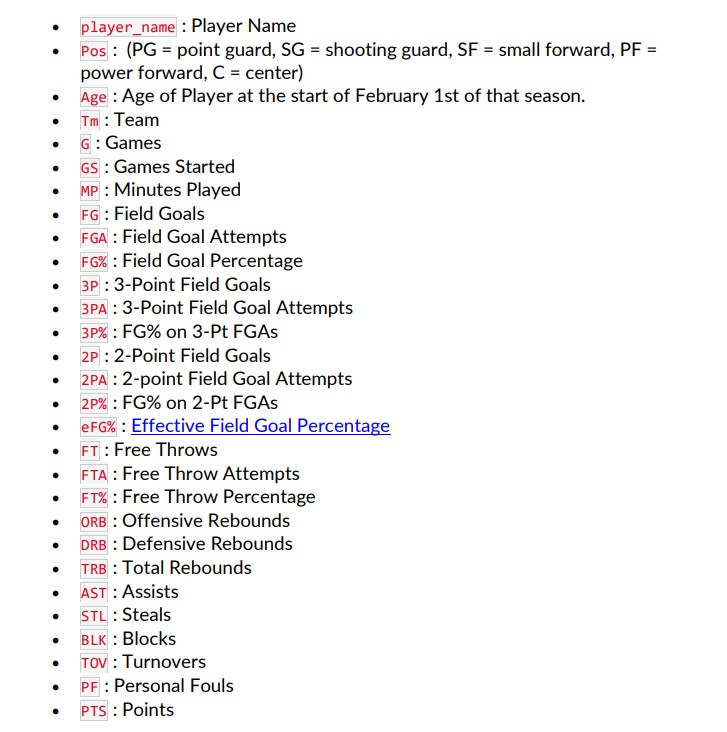
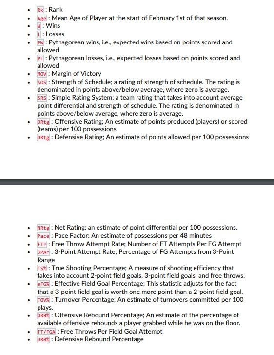
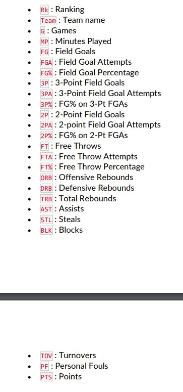
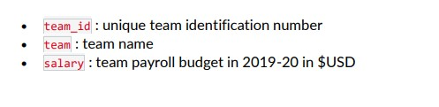

# Introduction

Basketball is a team sport in which two teams, most commonly of five players each, opposing one another on a rectangular court, compete with the primary objective of shooting a basketball (approximately 9.4 inches (24 cm) in diameter) through the defender's hoop (a basket 18 inches (46 cm) in diameter mounted 10 feet (3.048 m) high to a backboard at each end of the court, while preventing the opposing team from shooting through their own hoop. A field goal is worth two points, unless made from behind the three-point line, when it is worth three. After a foul, timed play stops and the player fouled or designated to shoot a technical foul is given one, two or three one-point free throws. The team with the most points at the end of the game wins, but if regulation play expires with the score tied, an additional period of play (overtime) is mandated.

Players advance the ball by bouncing it while walking or running (dribbling) or by passing it to a teammate, both of which require considerable skill. On offense, players may use a variety of shots -- the layup, the jump shot, or a dunk; on defense, they may steal the ball from a dribbler, intercept passes, or block shots; either offense or defense may collect a rebound, that is, a missed shot that bounces from rim or backboard. It is a violation to lift or drag one's pivot foot without dribbling the ball, to carry it, or to hold the ball with both hands then resume dribbling.

In the sport of basketball, there are generally five players per team, each assigned to positions. Historically, these players have been assigned to positions defined by the role they play on the court, from a strategic point of view. Broadly speaking, the three main positions are guard, forward, and center, with the standard team featuring two guards, two forwards, and a center. Over time, as more specialized roles developed, each of the guards and forwards came to be differentiated, and today each of the five positions are known by unique names, each of which has also been assigned a number: point guard (PG) or 1, the shooting guard (SG) or 2, the small forward (SF) or 3, the power forward (PF) or 4, and the center (C) or 5.


The point guard is the "leader" of the team on the court. This position requires substantial ball-handling skills and the ability to facilitate the team during a play. The shooting guard, as the name implies, is often the best shooter, as well as being capable of shooting accurately from longer distances. The small forward often has an aggressive approach to the basket when handling the ball. The small forward is also known to make cuts to the basket in efforts to get open for shots. The power forward and the center make up the frontcourt, often acting as their team's primary rebounders or shot blockers, or receiving passes to take inside shots. The center is typically the larger of the two.

## Background of the Project / scenario

You are a data analyst with the Chicago Bulls competing in the NBA (National Basketball Association). In the most recent NBA season (pretend last season was 2018-19), your team placed 27th out of 30 (based on win-loss record). Your team's budget for player contracts next season is \$118 million, ranked 26th out of 30 (for the purpose of this assignment, next season is 2019-20). For context, the team with the highest payroll budget is Portland with \$148 million, while the best performing team was Milwaukee Bucks (who clinched the best league record in 2018-19) with \$131 million.

## Objective

You have been tasked by the general manager of Chicago Bulls to find the best five starting players (one from each position) your team can afford. (Make sure you don't use up all of your money on just these five players, you still need to fill a full team roster, but are just focused on finding five starting players here). You can choose players that were already playing for Chicago Bulls in 2018-19, you just need to prove that they are worth it.

## Importance

Once we have the top 5 players or the best players based on the statistics we have, the probability of winning the Chicago Bulls will increase.

# Reading and cleaning the raw data

## NBA Player Salaries

```{r echo=FALSE}
    nba_player_salaries<-read.csv("data/2018-19_nba_player-salaries.csv")
    head(nba_player_salaries)
```

The above dataset has 3 columns, Id of the player, name and the salary of the player. Lets check for NA values

```{r echo=FALSE}
    sum(is.na(nba_player_salaries))
```

There are 0 NA values in this dataset.

## NBA Player Statistics

```{r echo=FALSE}
    nba_player_statistics<-read.csv("data/2018-19_nba_player-statistics.csv")
    head(nba_player_statistics)
```

The above dataset shows the statistics of each player. 

```{r echo=FALSE}
    sum(is.na(nba_player_statistics))
```

There are 117 NA values in this dataset. We are going to replace NA values with 0 in the dataset.

```{r echo=FALSE}
nba_player_statistics[is.na(nba_player_statistics)] <- 0

```

```{r echo=FALSE}
sum(is.na(nba_player_statistics))

```

## NBA Team Statistics 1

```{r echo=FALSE}
    nba_team_statistics_1<-read.csv("data/2018-19_nba_team-statistics_1.csv")
    head(nba_team_statistics_1)
```

The above dataset shows the statistics of Teams



```{r echo=FALSE}
    sum(is.na(nba_team_statistics_1))
```

There are 90 NA values in this dataset. We are going to replace NA values with 0 in the dataset.

```{r echo=FALSE}
nba_team_statistics_1[is.na(nba_team_statistics_1)] <- 0

```

```{r echo=FALSE}
sum(is.na(nba_team_statistics_1))

```

## NBA Team Statistics 2

```{r echo=FALSE}
    nba_team_statistics_2<-read.csv("data/2018-19_nba_team-statistics_2.csv")
    head(nba_team_statistics_2)
```

The above dataset shows the statistics of Teams.

{width="387"}

```{r echo=FALSE}
    sum(is.na(nba_team_statistics_2))
```

There are 0 NA values in this dataset.

## NBA Player Salaries

```{r echo=FALSE}
    nba_team_payroll<-read.csv("data/2019-20_nba_team-payroll.csv")
    head(nba_team_payroll)
```

The above dataset shows Team Payroll or the budget for the next season 

```{r echo=FALSE}
    sum(is.na(nba_team_payroll))
```

There are 0 NA values in this dataset.

# Exploratory analysis

## Analyzing Team Statistics

Merging Team statistics 1 and Team Statistics 2 into one dataframe

```{r}
   df <- merge(nba_team_statistics_1, nba_team_statistics_2, by = "Team")
```
Correlation Matrix of all the variables.
```{r echo=FALSE}
res <- cor(df[ , !(names(df) %in% c('Team','ï..Rk.x','X','X.1','X.2','G'))])
res <- round(res, 2)
res2 <- Hmisc::rcorr(as.matrix(res))

p1<-{corrplot::corrplot(res, type = "upper", order = "hclust", 
         tl.col = "black");
      recordPlot()
    }

#ggplot2::ggsave(filename = "Figs/correaltion_plot_all_variables.jpg", plot = replayPlot(p1))

```


1.  Plotting relationship between the Field goals and Points

```{r echo=FALSE}
library(ggplot2)
ggplot(nba_team_statistics_2, aes(x=FG, y=PTS)) +
  geom_point() + theme_classic()
sg5<-ggplot(nba_team_statistics_2, aes(x=FG, y=PTS)) +
  geom_point() + theme_classic()
ggsave("Figs/Field_goals_vs_Points.png", sg5, width = 720/72, height = 1280/72, dpi = 72)
```

It shows the positive correlation between these two varaibles

2.  Plotting relationship between the 3point field Goals and Points

```{r echo=FALSE}
ggplot(nba_team_statistics_2, aes(x=X3P, y=PTS)) +
  geom_point() + theme_classic()
sg5<-ggplot(nba_team_statistics_2, aes(x=X3P, y=PTS)) +
  geom_point() + theme_classic()
ggsave("Figs/3point_field_Goals_vs_Points.png", sg5, width = 720/72, height = 1280/72, dpi = 72)
```

It shows the positive correlation between these two varaibles

3.  Plotting relationship between the 2point field Goals and Points

```{r echo=FALSE}
ggplot(nba_team_statistics_2, aes(x= X2P, y=PTS)) +
  geom_point() + theme_classic()
sg5<-ggplot(nba_team_statistics_2, aes(x= X2P, y=PTS)) +
  geom_point() + theme_classic()
ggsave("Figs/2point_field_Goals_vs_Points.png", sg5, width = 720/72, height = 1280/72, dpi = 72)
```

It shows the somewhat neutral relationship between the varaibles.

4.  Plotting relationship between the Free Throws and Points

```{r echo=FALSE}
ggplot(nba_team_statistics_2, aes(x= FT, y=PTS)) +
  geom_point() + theme_classic()
sg5<-ggplot(nba_team_statistics_2, aes(x= FT, y=PTS)) +
  geom_point() + theme_classic()
ggsave("Figs/Free_Throws_vs_Points.png", sg5, width = 720/72, height = 1280/72, dpi = 72)
```

It shows the somewhat neutral relationship between the varaibles. But the Teams with more free throws have the chances of getting more goals in the game.

5.  Plotting relationship between the Block and Points

```{r echo=FALSE}
ggplot(nba_team_statistics_2, aes(x= BLK, y=PTS)) +
  geom_point() + theme_classic()
sg5<-ggplot(nba_team_statistics_2, aes(x= BLK, y=PTS)) +
  geom_point() + theme_classic()
ggsave("Figs/Block_vs_Points.png", sg5, width = 720/72, height = 1280/72, dpi = 72)
```

It shows the somewhat neutral relationship between the varaibles. But Blocks and points have direct relationship.

6.  Plotting relationship between the Steals and Points

```{r echo=FALSE}
ggplot(nba_team_statistics_2, aes(x= STL, y=PTS)) +
  geom_point() + theme_classic()
sg5<-ggplot(nba_team_statistics_2, aes(x= STL, y=PTS)) +
  geom_point() + theme_classic()
ggsave("Figs/Steals_vs_Points.png", sg5, width = 720/72, height = 1280/72, dpi = 72)
```

It shows the somewhat neutral relationship between the varaibles.

7.  Plotting relationship between the Assists and Points

```{r echo=FALSE}
ggplot(nba_team_statistics_2, aes(x= AST, y=PTS)) +
  geom_point() + theme_classic()
sg5<-ggplot(nba_team_statistics_2, aes(x= AST, y=PTS)) +
  geom_point() + theme_classic()
ggsave("Figs/Assists_vs_Points.png", sg5, width = 720/72, height = 1280/72, dpi = 72)
```

It shows the somewhat neutral relationship between the variables.


8.  Plotting relationship between the Age and Points

```{r echo=FALSE}
ggplot(df, aes(x= Age, y=PTS)) +
  geom_point() + theme_classic()
sg5<-ggplot(df, aes(x= Age, y=PTS)) +
  geom_point() + theme_classic()
ggsave("Figs/Age_vs_Points.png", sg5, width = 720/72, height = 1280/72, dpi = 72)
```

The Average age of the player should be between 25 to 27 years old.

9.  Plotting relationship between the Turnover Percentage and Points

```{r echo=FALSE}
ggplot(df, aes(x= TOV, y=PTS)) +
  geom_point() + theme_classic()
sg5<-ggplot(df, aes(x= TOV, y=PTS)) +
  geom_point() + theme_classic()
ggsave("Figs/Turnover_vs_Points.png", sg5, width = 720/72, height = 1280/72, dpi = 72)
```

Turnover percentage has no specific relation with the POints.

10. Plotting relationship between the : Effective Field Goal Percentage and Points

```{r echo=FALSE}
ggplot(df, aes(x= eFG., y=PTS)) +
  geom_point() + theme_classic()
sg5<-ggplot(df, aes(x= eFG., y=PTS)) +
  geom_point() + theme_classic()
ggsave("Figs/Effective_Field_Goal_Percentage_vs_Points.png", sg5, width = 720/72, height = 1280/72, dpi = 72)
```

Effective Field Goal Percentage is one of the important variable as it shows the positive relation with the Points scored.


### From the above analysis we can say that Field goals, 3point field Goals, 2point field Goals,Free Throws, Block, Effective Field Goal Percentage are the important factors with decides the points of the team as well as the winning probability. Lets build the model.

Correlation Matrix of the analysed variables.

```{r echo = FALSE}
res <- cor(df[ , (names(df) %in% c('Age','FG','X3P','X2P','FT','BLK','STL','AST','TOV','eFG.','PTS'))])
round(res, 2)
res2 <- Hmisc::rcorr(as.matrix(res))
corrplot::corrplot(res, type = "upper", order = "hclust", 
        tl.col = "black")
```

# Data modelling and results

## a) data modelling (e.g. creating a linear regression)
So if We run Linear Regression Model these variables to see how good they are in predicting the Points of model.

```{r echo = FALSE}
    model <- lm(PTS~Age+FG+X3P+X2P+FT+BLK+STL+AST+TOV+eFG., data = df)
    summary(model)
```
## b) assumption checking

### Linearity of the data
The linearity assumption can be checked by inspecting the Residuals vs Fitted plot (1st plot):

```{r echo = FALSE}
  plot(model, 1)
```

There is no pattern in the residual plot. This suggests that we can assume linear relationship between the predictors and the outcome variables.

### Homogeneity of variance
This assumption can be checked by examining the scale-location plot, also known as the spread-location plot.

```{r echo = FALSE}
  plot(model, 3)
```

This plot shows if residuals are spread equally along the ranges of predictors. It’s good if you see a horizontal line with equally spread points.

### Normality of residuals
The QQ plot of residuals can be used to visually check the normality assumption. The normal probability plot of residuals should approximately follow a straight line.

```{r echo = FALSE}
  plot(model, 2)
```

All the points fall approximately along this reference line, so we can assume normality.

### Influential values
The following plots illustrate the Cook’s distance and the leverage of our model:

```{r echo = FALSE}
# Cook's distance
plot(model, 4)

```

```{r echo = FALSE}
# Residuals vs Leverage
plot(model, 5)
```

## c) model output and interpretation of Linear model
From the Summary we can say that variables Field goals, 3point field Goals, 2point field Goals,Free Throws,Turnovers, Effective Field Goal Percentage are the important variables or skills required in any player to score maximum goals for the team.

Here we can see some variables significant while some are insignificant variables. Significant of variables can be decided by the p value. If p value is less than 0.05 then we reject the null hypothesis and that where we accept the alternative hypothesis which is “h0 not equal to 0”.

Also the p values of thoes varaibles are below 0.05.
R-squared value is also 1 with P values less 2.2e-16


# Player recommendations
Based on above characteristics we can select players.Field goals, 3point field Goals,Free Throws,Turnovers,2point field Goals are deciding parameter while selecting the players.
As the Chicago bulls budget is $118 million for next season.

Subset the dataset into position based dataframes.

Shooting Guard

```{r echo = FALSE}
SG_data <- subset(nba_player_statistics, Pos == "SG")
head(SG_data)
```

Power Forward

```{r echo = FALSE}
PF_data <- subset(nba_player_statistics, Pos == "PF")
head(PF_data)
```

Center

```{r echo = FALSE}
C_data <- subset(nba_player_statistics, Pos == "C")
head(C_data)
```

Small Forward

```{r echo = FALSE}
SF_data <- subset(nba_player_statistics, Pos == "SF")
head(SF_data)
```

Point Guard

```{r echo = FALSE}
PG_data <- subset(nba_player_statistics, Pos == "PG")
head(PG_data)
```

There are duplicates in the player statistics, lets keep the best entry with the maximum points.

```{r echo = FALSE}
library(dplyr)
SG_data <- SG_data %>% 
        group_by(player_name) %>%
        top_n(1, abs(PTS))
PF_data <- PF_data %>% 
        group_by(player_name) %>%
        top_n(1, abs(PTS))
C_data <- C_data %>% 
        group_by(player_name) %>%
        top_n(1, abs(PTS))
SF_data <- SF_data %>% 
        group_by(player_name) %>%
        top_n(1, abs(PTS))
PG_data <- PG_data %>% 
        group_by(player_name) %>%
        top_n(1, abs(PTS))
```


### Plotting - Shooting Guard DataFrame Analysis

```{r echo=FALSE}
library(ggplot2)
SG_data1 <- SG_data[order(SG_data$FG, decreasing = TRUE),] 
ggplot(head(SG_data1, n = 10), aes(player_name,FG)) + 
    geom_bar(stat = "identity") + 
    labs(y = "Field Goals", x = "Player Name") +
    theme(axis.text.x = element_text(angle = 90, vjust = 0.5, hjust=1))
sg1<-ggplot(head(SG_data1, n = 10), aes(player_name,FG)) + 
    geom_bar(stat = "identity") + 
    labs(y = "Field Goals", x = "Player Name") +
    theme(axis.text.x = element_text(angle = 90, vjust = 0.5, hjust=1))
ggsave("Figs/SG_Field_Goals_Player.png", sg1, width = 720/72, height = 1280/72, dpi = 72)
```

```{r echo=FALSE}
SG_data2 <- SG_data[order(SG_data$X3P, decreasing = TRUE),] 
ggplot(head(SG_data2, n = 10), aes(player_name,X3P)) + 
    geom_bar(stat = "identity") + 
    labs(y = "3-Point_Field_Goals", x = "Player Name") +
    theme(axis.text.x = element_text(angle = 90, vjust = 0.5, hjust=1))
sg2<-ggplot(head(SG_data2, n = 10), aes(player_name,X3P)) + 
    geom_bar(stat = "identity") + 
    labs(y = "3-Point_Field_Goals", x = "Player Name") +
    theme(axis.text.x = element_text(angle = 90, vjust = 0.5, hjust=1))
ggsave("Figs/SG_3-Point_Field_Goals.png", sg2, width = 720/72, height = 1280/72, dpi = 72)
``` 

```{r echo=FALSE}

SG_data3 <- SG_data[order(SG_data$X2P, decreasing = TRUE),] 
ggplot(head(SG_data3, n = 10), aes(player_name,X2P)) + 
    geom_bar(stat = "identity") + 
    labs(y = "2-Point Field Goals", x = "Player Name") +
    theme(axis.text.x = element_text(angle = 90, vjust = 0.5, hjust=1))
sg3<-ggplot(head(SG_data3, n = 10), aes(player_name,X2P)) + 
    geom_bar(stat = "identity") + 
    labs(y = "2-Point Field Goals", x = "Player Name") +
    theme(axis.text.x = element_text(angle = 90, vjust = 0.5, hjust=1))
ggsave("Figs/SG_2-Point_Field_Goals.png", sg3, width = 720/72, height = 1280/72, dpi = 72)
```

```{r echo=FALSE}
SG_data4 <- SG_data[order(SG_data$TOV, decreasing = TRUE),] 
ggplot(head(SG_data4, n = 10), aes(player_name,TOV)) + 
    geom_bar(stat = "identity") + 
    labs(y = " Turnovers", x = "Player Name") +
    theme(axis.text.x = element_text(angle = 90, vjust = 0.5, hjust=1))
sg4<-ggplot(head(SG_data4, n = 10), aes(player_name,TOV)) + 
    geom_bar(stat = "identity") + 
    labs(y = " Turnovers", x = "Player Name") +
    theme(axis.text.x = element_text(angle = 90, vjust = 0.5, hjust=1))
ggsave("Figs/SG_Turnovers.png", sg4, width = 720/72, height = 1280/72, dpi = 72)
```

```{r echo=FALSE}
SG_data5 <- SG_data[order(SG_data$FT, decreasing = TRUE),] 
ggplot(head(SG_data5, n = 10), aes(player_name,FT)) + 
    geom_bar(stat = "identity") + 
    labs(y = "Free Throws", x = "Player Name") +
    theme(axis.text.x = element_text(angle = 90, vjust = 0.5, hjust=1))
sg5<-ggplot(head(SG_data5, n = 10), aes(player_name,FT)) + 
    geom_bar(stat = "identity") + 
    labs(y = "Free Throws", x = "Player Name") +
    theme(axis.text.x = element_text(angle = 90, vjust = 0.5, hjust=1))
ggsave("Figs/SG_Free_Throws.png", sg5, width = 720/72, height = 1280/72, dpi = 72)
```


### Plotting - Power Forward DataFrame Analysis

```{r echo=FALSE}
library(ggplot2)
PF_data1 <- PF_data[order(PF_data$FG, decreasing = TRUE),] 
ggplot(head(PF_data1, n = 10), aes(player_name,FG)) + 
    geom_bar(stat = "identity") + 
    labs(y = "Field Goals", x = "Player Name") +
    theme(axis.text.x = element_text(angle = 90, vjust = 0.5, hjust=1))
sg1<-ggplot(head(PF_data1, n = 10), aes(player_name,FG)) + 
    geom_bar(stat = "identity") + 
    labs(y = "Field Goals", x = "Player Name") +
    theme(axis.text.x = element_text(angle = 90, vjust = 0.5, hjust=1))
ggsave("Figs/PF_Field_Goals_Player.png", sg1, width = 720/72, height = 1280/72, dpi = 72)
```

```{r echo=FALSE}
PF_data2 <- PF_data[order(PF_data$FG, decreasing = TRUE),] 
ggplot(head(PF_data2, n = 10), aes(player_name,X3P)) + 
    geom_bar(stat = "identity") + 
    labs(y = "3-Point Field Goals", x = "Player Name") +
    theme(axis.text.x = element_text(angle = 90, vjust = 0.5, hjust=1))
sg2<-ggplot(head(PF_data2, n = 10), aes(player_name,X3P)) + 
    geom_bar(stat = "identity") + 
    labs(y = "3-Point Field Goals", x = "Player Name") +
    theme(axis.text.x = element_text(angle = 90, vjust = 0.5, hjust=1))
ggsave("Figs/PF_3-Point_Field_Goals.png", sg2, width = 720/72, height = 1280/72, dpi = 72)
``` 

```{r echo=FALSE}
PF_data3 <- PF_data[order(PF_data$FG, decreasing = TRUE),] 
ggplot(head(PF_data3, n = 10), aes(player_name,X2P)) + 
    geom_bar(stat = "identity") + 
    labs(y = "2-Point Field Goals", x = "Player Name") +
    theme(axis.text.x = element_text(angle = 90, vjust = 0.5, hjust=1))
sg3<-ggplot(head(PF_data3, n = 10), aes(player_name,X2P)) + 
    geom_bar(stat = "identity") + 
    labs(y = "2-Point Field Goals", x = "Player Name") +
    theme(axis.text.x = element_text(angle = 90, vjust = 0.5, hjust=1))
ggsave("Figs/PF_2-Point_Field_Goals.png", sg3, width = 720/72, height = 1280/72, dpi = 72)
```

```{r echo=FALSE}
PF_data4 <- PF_data[order(PF_data$FG, decreasing = TRUE),] 
ggplot(head(PF_data4, n = 10), aes(player_name,TOV)) + 
    geom_bar(stat = "identity") + 
    labs(y = " Turnovers", x = "Player Name") +
    theme(axis.text.x = element_text(angle = 90, vjust = 0.5, hjust=1))
sg4<-ggplot(head(PF_data4, n = 10), aes(player_name,TOV)) + 
    geom_bar(stat = "identity") + 
    labs(y = " Turnovers", x = "Player Name") +
    theme(axis.text.x = element_text(angle = 90, vjust = 0.5, hjust=1))
ggsave("Figs/PF_Turnovers.png", sg4, width = 720/72, height = 1280/72, dpi = 72)
```

```{r echo=FALSE}
PF_data5 <- PF_data[order(PF_data$FG, decreasing = TRUE),] 
ggplot(head(PF_data5, n = 10), aes(player_name,FT)) + 
    geom_bar(stat = "identity") + 
    labs(y = "Free Throws", x = "Player Name") +
    theme(axis.text.x = element_text(angle = 90, vjust = 0.5, hjust=1))
sg5<-ggplot(head(PF_data5, n = 10), aes(player_name,FT)) + 
    geom_bar(stat = "identity") + 
    labs(y = "Free Throws", x = "Player Name") +
    theme(axis.text.x = element_text(angle = 90, vjust = 0.5, hjust=1))
ggsave("Figs/PF_Free_Throws.png", sg5, width = 720/72, height = 1280/72, dpi = 72)
```


### Plotting - Center DataFrame Analysis

```{r echo=FALSE}
library(ggplot2)
C_data1 <- C_data[order(C_data$FG, decreasing = TRUE),] 
ggplot(head(C_data1, n = 10), aes(player_name,FG)) + 
    geom_bar(stat = "identity") + 
    labs(y = "Field Goals", x = "Player Name") +
    theme(axis.text.x = element_text(angle = 90, vjust = 0.5, hjust=1))
sg1<-ggplot(head(C_data1, n = 10), aes(player_name,FG)) + 
    geom_bar(stat = "identity") + 
    labs(y = "Field Goals", x = "Player Name") +
    theme(axis.text.x = element_text(angle = 90, vjust = 0.5, hjust=1))
ggsave("Figs/C_Field_Goals_Player.png", sg1, width = 720/72, height = 1280/72, dpi = 72)
```

```{r echo=FALSE}
C_data2 <- C_data[order(C_data$FG, decreasing = TRUE),] 
ggplot(head(C_data2, n = 10), aes(player_name,X3P)) + 
    geom_bar(stat = "identity") + 
    labs(y = "3-Point Field Goals", x = "Player Name") +
    theme(axis.text.x = element_text(angle = 90, vjust = 0.5, hjust=1))
sg2<-ggplot(head(C_data2, n = 10), aes(player_name,X3P)) + 
    geom_bar(stat = "identity") + 
    labs(y = "3-Point Field Goals", x = "Player Name") +
    theme(axis.text.x = element_text(angle = 90, vjust = 0.5, hjust=1))
ggsave("Figs/C_3-Point_Field_Goals.png", sg2, width = 720/72, height = 1280/72, dpi = 72)
``` 

```{r echo=FALSE}
C_data3 <- C_data[order(C_data$FG, decreasing = TRUE),] 
ggplot(head(C_data3, n = 10), aes(player_name,X2P)) + 
    geom_bar(stat = "identity") + 
    labs(y = "2-Point Field Goals", x = "Player Name") +
    theme(axis.text.x = element_text(angle = 90, vjust = 0.5, hjust=1))
sg3<-ggplot(head(C_data3, n = 10), aes(player_name,X2P)) + 
    geom_bar(stat = "identity") + 
    labs(y = "2-Point Field Goals", x = "Player Name") +
    theme(axis.text.x = element_text(angle = 90, vjust = 0.5, hjust=1))
ggsave("Figs/C_2-Point_Field_Goals.png", sg3, width = 720/72, height = 1280/72, dpi = 72)
```

```{r echo=FALSE}
C_data4 <- C_data[order(C_data$FG, decreasing = TRUE),] 
ggplot(head(C_data4, n = 10), aes(player_name,TOV)) + 
    geom_bar(stat = "identity") + 
    labs(y = " Turnovers", x = "Player Name") +
    theme(axis.text.x = element_text(angle = 90, vjust = 0.5, hjust=1))
sg4<-ggplot(head(C_data4, n = 10), aes(player_name,TOV)) + 
    geom_bar(stat = "identity") + 
    labs(y = " Turnovers", x = "Player Name") +
    theme(axis.text.x = element_text(angle = 90, vjust = 0.5, hjust=1))
ggsave("Figs/C_Turnovers.png", sg4, width = 720/72, height = 1280/72, dpi = 72)
```

```{r echo=FALSE}
C_data5 <- C_data[order(C_data$FG, decreasing = TRUE),] 
ggplot(head(C_data5, n = 10), aes(player_name,FT)) + 
    geom_bar(stat = "identity") + 
    labs(y = "Free Throws", x = "Player Name") +
    theme(axis.text.x = element_text(angle = 90, vjust = 0.5, hjust=1))
sg5<-ggplot(head(C_data5, n = 10), aes(player_name,FT)) + 
    geom_bar(stat = "identity") + 
    labs(y = "Free Throws", x = "Player Name") +
    theme(axis.text.x = element_text(angle = 90, vjust = 0.5, hjust=1))
ggsave("Figs/C_Free_Throws.png", sg5, width = 720/72, height = 1280/72, dpi = 72)
```


### Plotting - Small Forward DataFrame Analysis

```{r echo=FALSE}
library(ggplot2)
SF_data1 <- SF_data[order(SF_data$FG, decreasing = TRUE),]
ggplot(head(SF_data1, n = 10), aes(player_name,FG)) + 
    geom_bar(stat = "identity") + 
    labs(y = "Field Goals", x = "Player Name") +
    theme(axis.text.x = element_text(angle = 90, vjust = 0.5, hjust=1))
sg1<-ggplot(head(SF_data1, n = 10), aes(player_name,FG)) + 
    geom_bar(stat = "identity") + 
    labs(y = "Field Goals", x = "Player Name") +
    theme(axis.text.x = element_text(angle = 90, vjust = 0.5, hjust=1))
ggsave("Figs/SF_Field_Goals_Player.png", sg1, width = 720/72, height = 1280/72, dpi = 72)
```

```{r echo=FALSE}
SF_data2 <- SF_data[order(SF_data$FG, decreasing = TRUE),]
ggplot(head(SF_data2, n = 10), aes(player_name,X3P)) + 
    geom_bar(stat = "identity") + 
    labs(y = "3-Point Field Goals", x = "Player Name") +
    theme(axis.text.x = element_text(angle = 90, vjust = 0.5, hjust=1))
sg2<-ggplot(head(SF_data2, n = 10), aes(player_name,X3P)) + 
    geom_bar(stat = "identity") + 
    labs(y = "3-Point Field Goals", x = "Player Name") +
    theme(axis.text.x = element_text(angle = 90, vjust = 0.5, hjust=1))
ggsave("Figs/SF_3-Point_Field_Goals.png", sg2, width = 720/72, height = 1280/72, dpi = 72)
``` 

```{r echo=FALSE}
SF_data3 <- SF_data[order(SF_data$FG, decreasing = TRUE),]
ggplot(head(SF_data3, n = 10), aes(player_name,X2P)) + 
    geom_bar(stat = "identity") + 
    labs(y = "2-Point Field Goals", x = "Player Name") +
    theme(axis.text.x = element_text(angle = 90, vjust = 0.5, hjust=1))
sg3<-ggplot(head(SF_data3, n = 10), aes(player_name,X2P)) + 
    geom_bar(stat = "identity") + 
    labs(y = "2-Point Field Goals", x = "Player Name") +
    theme(axis.text.x = element_text(angle = 90, vjust = 0.5, hjust=1))
ggsave("Figs/SF_2-Point_Field_Goals.png", sg3, width = 720/72, height = 1280/72, dpi = 72)
```

```{r echo=FALSE}
SF_data4 <- SF_data[order(SF_data$FG, decreasing = TRUE),]
ggplot(head(SF_data4, n = 10), aes(player_name,TOV)) + 
    geom_bar(stat = "identity") + 
    labs(y = " Turnovers", x = "Player Name") +
    theme(axis.text.x = element_text(angle = 90, vjust = 0.5, hjust=1))
sg4<-ggplot(head(SF_data4, n = 10), aes(player_name,TOV)) + 
    geom_bar(stat = "identity") + 
    labs(y = " Turnovers", x = "Player Name") +
    theme(axis.text.x = element_text(angle = 90, vjust = 0.5, hjust=1))
ggsave("Figs/SF_Turnovers.png", sg4, width = 720/72, height = 1280/72, dpi = 72)
```

```{r echo=FALSE}
SF_data5 <- SF_data[order(SF_data$FG, decreasing = TRUE),]
ggplot(head(SF_data5, n = 10), aes(player_name,FT)) + 
    geom_bar(stat = "identity") + 
    labs(y = "Free Throws", x = "Player Name") +
    theme(axis.text.x = element_text(angle = 90, vjust = 0.5, hjust=1))
sg5<-ggplot(head(SF_data5, n = 10), aes(player_name,FT)) + 
    geom_bar(stat = "identity") + 
    labs(y = "Free Throws", x = "Player Name") +
    theme(axis.text.x = element_text(angle = 90, vjust = 0.5, hjust=1))
ggsave("Figs/SF_Free_Throws.png", sg5, width = 720/72, height = 1280/72, dpi = 72)
```


### Plotting - Point Guard DataFrame Analysis

```{r echo=FALSE}
library(ggplot2)
PG_data1 <- PG_data[order(PG_data$FG, decreasing = TRUE),]
ggplot(head(PG_data1, n = 10), aes(player_name,FG)) + 
    geom_bar(stat = "identity") + 
    labs(y = "Field Goals", x = "Player Name") +
    theme(axis.text.x = element_text(angle = 90, vjust = 0.5, hjust=1))
sg1<-ggplot(head(PG_data1, n = 10), aes(player_name,FG)) + 
    geom_bar(stat = "identity") + 
    labs(y = "Field Goals", x = "Player Name") +
    theme(axis.text.x = element_text(angle = 90, vjust = 0.5, hjust=1))
ggsave("Figs/PG_Field_Goals_Player.png", sg1, width = 720/72, height = 1280/72, dpi = 72)
```

```{r echo=FALSE}
PG_data2 <- PG_data[order(PG_data$FG, decreasing = TRUE),]
ggplot(head(PG_data2, n = 10), aes(player_name,X3P)) + 
    geom_bar(stat = "identity") + 
    labs(y = "3-Point Field Goals", x = "Player Name") +
    theme(axis.text.x = element_text(angle = 90, vjust = 0.5, hjust=1))
sg2<-ggplot(head(PG_data2, n = 10), aes(player_name,X3P)) + 
    geom_bar(stat = "identity") + 
    labs(y = "3-Point Field Goals", x = "Player Name") +
    theme(axis.text.x = element_text(angle = 90, vjust = 0.5, hjust=1))
ggsave("Figs/PG_3-Point_Field_Goals.png", sg2, width = 720/72, height = 1280/72, dpi = 72)
``` 

```{r echo=FALSE}
PG_data3 <- PG_data[order(PG_data$FG, decreasing = TRUE),]
ggplot(head(PG_data3, n = 10), aes(player_name,X2P)) + 
    geom_bar(stat = "identity") + 
    labs(y = "2-Point Field Goals", x = "Player Name") +
    theme(axis.text.x = element_text(angle = 90, vjust = 0.5, hjust=1))
sg3<-ggplot(head(PG_data, n = 10), aes(player_name,X2P)) + 
    geom_bar(stat = "identity") + 
    labs(y = "2-Point Field Goals", x = "Player Name") +
    theme(axis.text.x = element_text(angle = 90, vjust = 0.5, hjust=1))
ggsave("Figs/PG_2-Point_Field_Goals.png", sg3, width = 720/72, height = 1280/72, dpi = 72)
```

```{r echo=FALSE}
PG_data4 <- PG_data[order(PG_data$FG, decreasing = TRUE),]
ggplot(head(PG_data4, n = 10), aes(player_name,TOV)) + 
    geom_bar(stat = "identity") + 
    labs(y = " Turnovers", x = "Player Name") +
    theme(axis.text.x = element_text(angle = 90, vjust = 0.5, hjust=1))
sg4<-ggplot(head(PG_data4, n = 10), aes(player_name,TOV)) + 
    geom_bar(stat = "identity") + 
    labs(y = " Turnovers", x = "Player Name") +
    theme(axis.text.x = element_text(angle = 90, vjust = 0.5, hjust=1))
ggsave("Figs/PG_Turnovers.png", sg4, width = 720/72, height = 1280/72, dpi = 72)
```

```{r echo=FALSE}
PG_data5 <- PG_data[order(PG_data$FG, decreasing = TRUE),]
ggplot(head(PG_data5, n = 10), aes(player_name,FT)) + 
    geom_bar(stat = "identity") + 
    labs(y = "Free Throws", x = "Player Name") +
    theme(axis.text.x = element_text(angle = 90, vjust = 0.5, hjust=1))
sg5<-ggplot(head(PG_data5, n = 10), aes(player_name,FT)) + 
    geom_bar(stat = "identity") + 
    labs(y = "Free Throws", x = "Player Name") +
    theme(axis.text.x = element_text(angle = 90, vjust = 0.5, hjust=1))
ggsave("Figs/PG_Free_Throws.png", sg5, width = 720/72, height = 1280/72, dpi = 72)
```


### Players recommended for Shooting Guard : Bradley Beal, Buddy Hield, Klay Thompson
### Players recommended for Power Forward : Gianis Anteokounpo, Tobias Harris, Blake Griffin
### Players recommended for Point Guard : James Hardsen, Stephen Cury
### Players recommended for Center : Nikola Vucevic, Lamaracus Adridge, Karl-Anthony Towns
### Players recommended for Small Forward : Paul George, Kevin Durant, Kawhi Leonard 

```{r echo = FALSE}
SG_list = c('Bradley Beal','Buddy Hield','Klay Thompson')
PF_list = c('Giannis Antetokounmpo','Tobias Harris','Blake Griffin')
PG_list = c('James Harden','Stephen Curry')
C_list = c('Nikola Vucevic','LaMarcus Aldridge','Karl-Anthony Towns')
SF_list = c('Paul George','Kevin Durant','Kawhi Leonard')
```

### Players Salaries

#### Shooting Guard

```{r echo = FALSE}
nba_player_salaries[nba_player_salaries$player_name %in% SG_list,]
```

#### Power Forward

```{r echo = FALSE}
nba_player_salaries[nba_player_salaries$player_name %in% PF_list,]
```

#### Point Guard

```{r echo = FALSE}
nba_player_salaries[nba_player_salaries$player_name %in% PG_list,]
```

#### Center

```{r echo = FALSE}
nba_player_salaries[nba_player_salaries$player_name %in% C_list,]
```

#### Small Forward

```{r echo = FALSE}
nba_player_salaries[nba_player_salaries$player_name %in% SF_list,]
```


### We will select the players based on salary and the skills

### Recommended Players for each Positions are
### - Shooting Guard -> Bradley Beal
### - Power Forward -> Tobias Harris
### - Point Guard -> James Hardsen
### - Center -> Karl-Anthony Towns
### - Small Forward -> Kevin Durant

### The Budget of the Chicago Bull for the next season is 118 Million. So total cost of these five players is $108643697. So we are left with $93,56,303.


# Summary

### 1. In the Game of basketBall there are five important positions, Shooting Guarg, Point Forward, Point Guard, Center, Small Forward.
### 2. Based on the Regression Modeling we can say that the Field goals, 3point field Goals,Free Throws,Turnovers,2point field Goals are significant variables to win the game.
### 3. We have select the above players based on analysis.

# Reference List

- [Basketball Positions](https://en.wikipedia.org/wiki/Basketball_positions)
- [Reference Case Study](https://rafalab.github.io/dsbook/linear-models.html#case-study-moneyball)


